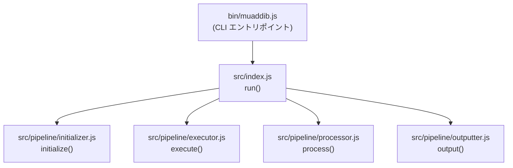
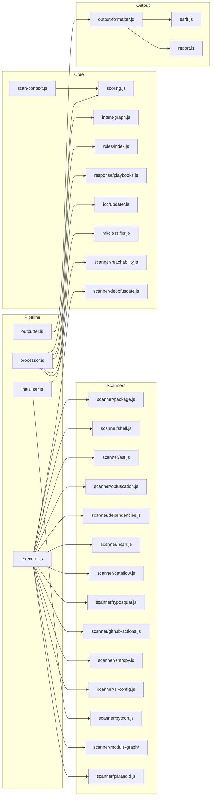
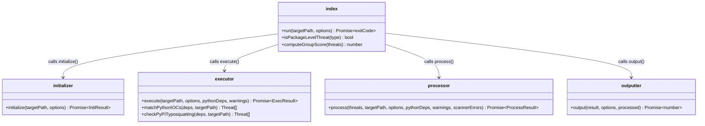
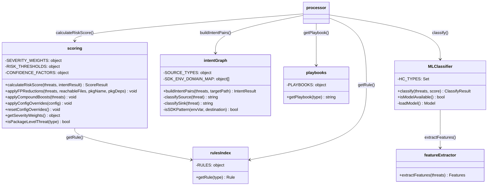
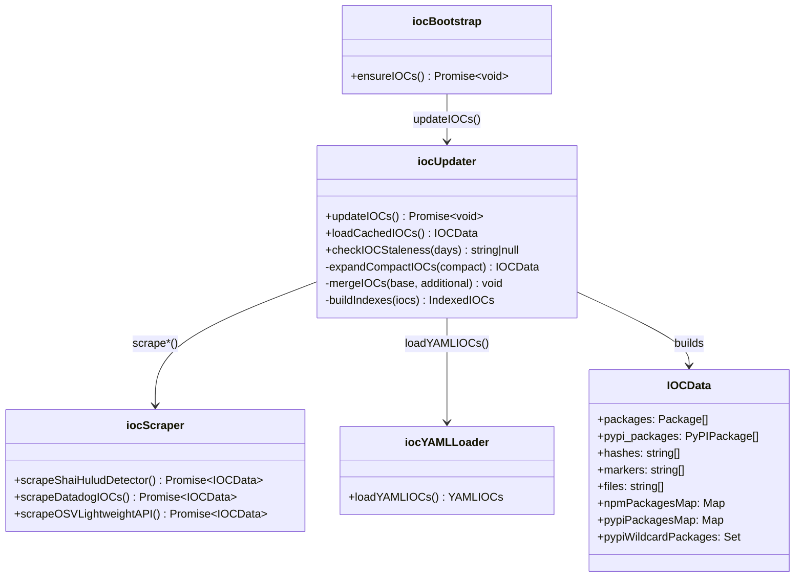
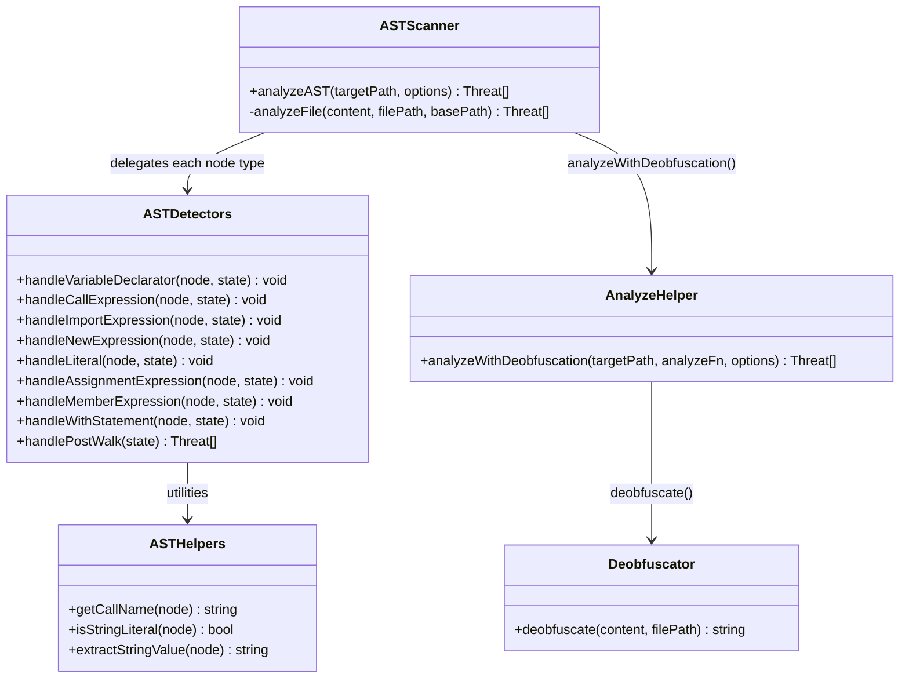
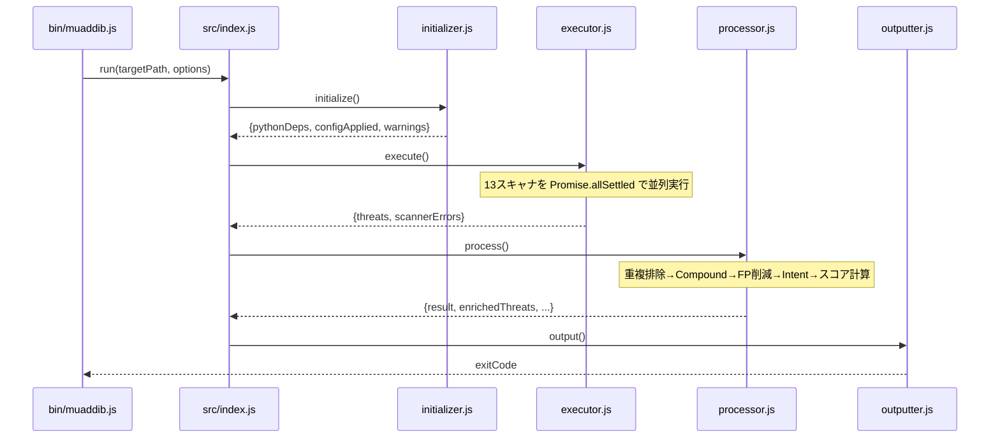
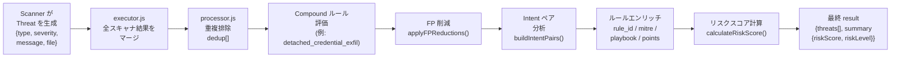

# MUAD'DIB ソースコード解説 — モジュール関係図

本フォルダには、MUAD'DIB の主要ソースファイルごとのコード解説ドキュメントが格納されています。

## ドキュメント一覧

| ファイル | 対応ソース |
|---|---|
| [src-index.md](./src-index.md) | `src/index.js` — ライブラリエントリポイント |
| [pipeline-initializer.md](./pipeline-initializer.md) | `src/pipeline/initializer.js` — Phase 1: 初期化 |
| [pipeline-executor.md](./pipeline-executor.md) | `src/pipeline/executor.js` — Phase 2: スキャン実行 |
| [pipeline-processor.md](./pipeline-processor.md) | `src/pipeline/processor.js` — Phase 3: 脅威処理 |
| [pipeline-outputter.md](./pipeline-outputter.md) | `src/pipeline/outputter.js` — Phase 4: 出力 |
| [scanner-ast.md](./scanner-ast.md) | `src/scanner/ast.js` — AST 解析エンジン |
| [scanner-dataflow.md](./scanner-dataflow.md) | `src/scanner/dataflow.js` — データフロー解析 |
| [scanner-module-graph.md](./scanner-module-graph.md) | `src/scanner/module-graph/` — クロスファイル解析 |
| [scoring.md](./scoring.md) | `src/scoring.js` — リスクスコアリング |
| [intent-graph.md](./intent-graph.md) | `src/intent-graph.js` — インテントグラフ解析 |
| [ioc.md](./ioc.md) | `src/ioc/` — IOC データベース管理 |
| [rules-playbooks.md](./rules-playbooks.md) | `src/rules/index.js` + `src/response/playbooks.js` |
| [ml-classifier.md](./ml-classifier.md) | `src/ml/classifier.js` — ML 分類器 |
| [scan-context.md](./scan-context.md) | `src/scan-context.js` — スキャンコンテキスト管理 |

---

## システム全体の構成図

---

## モジュール依存関係図（全体）

---

## UML クラス図 — パイプラインコンポーネント

---

## UML クラス図 — スキャナ群

```mermaid
classDiagram
    class Scanner {
        <<interface>>
        +scan(targetPath) Threat[]
    }

    class PackageScanner {
        +scanPackageJson(targetPath) Threat[]
    }
    class ShellScanner {
        +scanShellScripts(targetPath) Threat[]
    }
    class ASTScanner {
        +analyzeAST(targetPath, options) Promise~Threat[]~
        -analyzeFile(content, filePath, basePath) Threat[]
    }
    class ObfuscationScanner {
        +detectObfuscation(targetPath) Threat[]
    }
    class DependencyScanner {
        +scanDependencies(targetPath) Threat[]
    }
    class HashScanner {
        +scanHashes(targetPath) Threat[]
    }
    class DataflowScanner {
        +analyzeDataFlow(targetPath, options) Promise~Threat[]~
        -buildTaintMap(ast) Map
        -analyzeSinks(ast, taintMap) Threat[]
    }
    class TyposquatScanner {
        +scanTyposquatting(targetPath) Threat[]
        +findPyPITyposquatMatch(name) Match
    }
    class GitHubActionsScanner {
        +scanGitHubActions(targetPath) Threat[]
    }
    class EntropyScanner {
        +scanEntropy(targetPath, options) Promise~Threat[]~
    }
    class AIConfigScanner {
        +scanAIConfig(targetPath) Threat[]
    }
    class PythonScanner {
        +detectPythonProject(targetPath) PythonDep[]
        +normalizePythonName(name) string
    }
    class ModuleGraphScanner {
        +buildModuleGraph(targetPath) Graph
        +annotateTaintedExports(graph) TaintedMap
        +annotateSinkExports(graph) SinkMap
        +detectCrossFileFlows(graph, tainted, sinks) Flow[]
        +detectCallbackCrossFileFlows(graph, tainted, sinks) Flow[]
        +detectEventEmitterFlows(graph, tainted, sinks) Flow[]
    }

    Scanner <|.. PackageScanner
    Scanner <|.. ShellScanner
    Scanner <|.. ASTScanner
    Scanner <|.. ObfuscationScanner
    Scanner <|.. DependencyScanner
    Scanner <|.. HashScanner
    Scanner <|.. DataflowScanner
    Scanner <|.. TyposquatScanner
    Scanner <|.. GitHubActionsScanner
    Scanner <|.. EntropyScanner
    Scanner <|.. AIConfigScanner
    Scanner <|.. PythonScanner
    Scanner <|.. ModuleGraphScanner
```

---

## UML クラス図 — スコアリング・ルール・ML

---

## UML クラス図 — IOC システム

---

## UML クラス図 — AST 検出器サブシステム

---

## データフロー図 — スキャン実行の流れ

---

## データフロー図 — 脅威オブジェクトのライフサイクル

